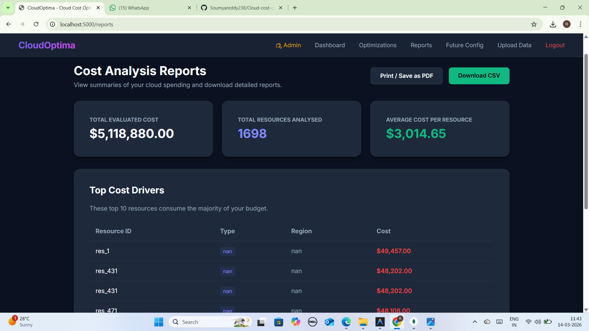
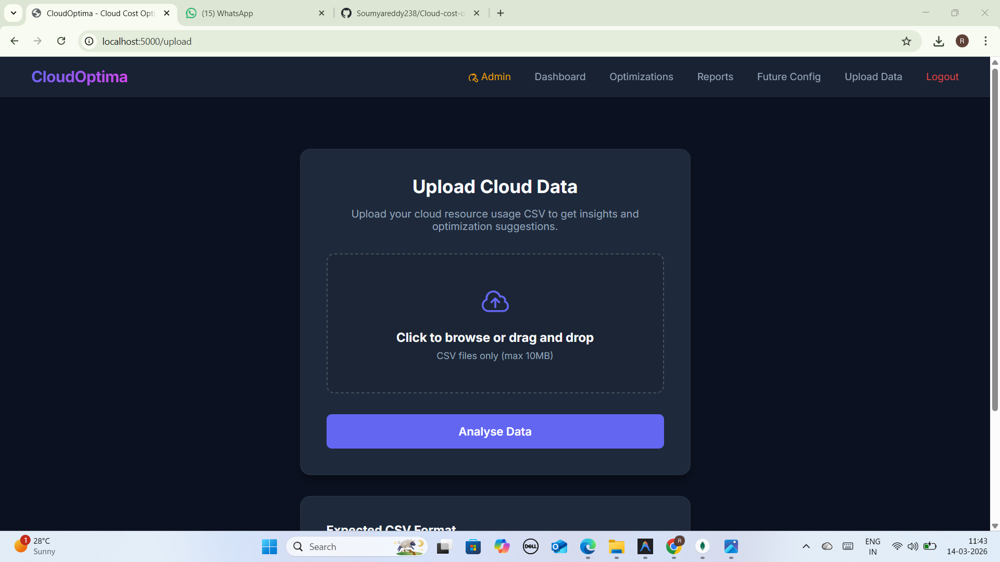
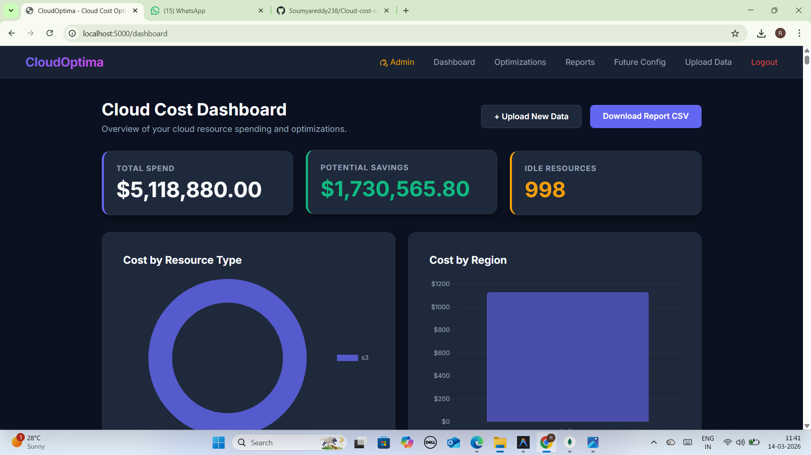
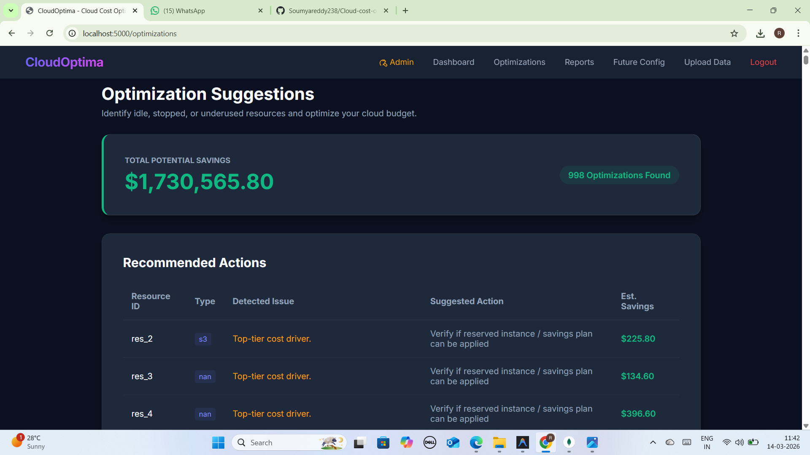
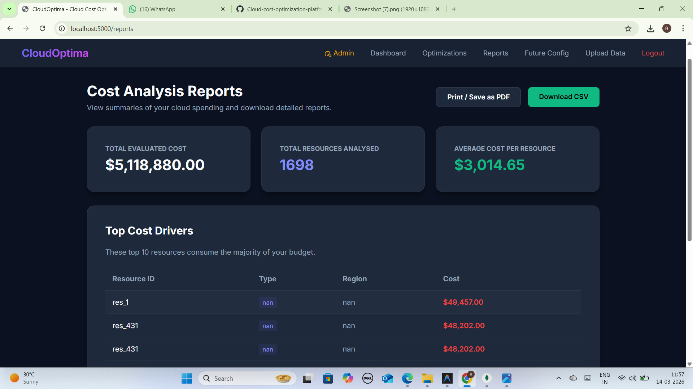
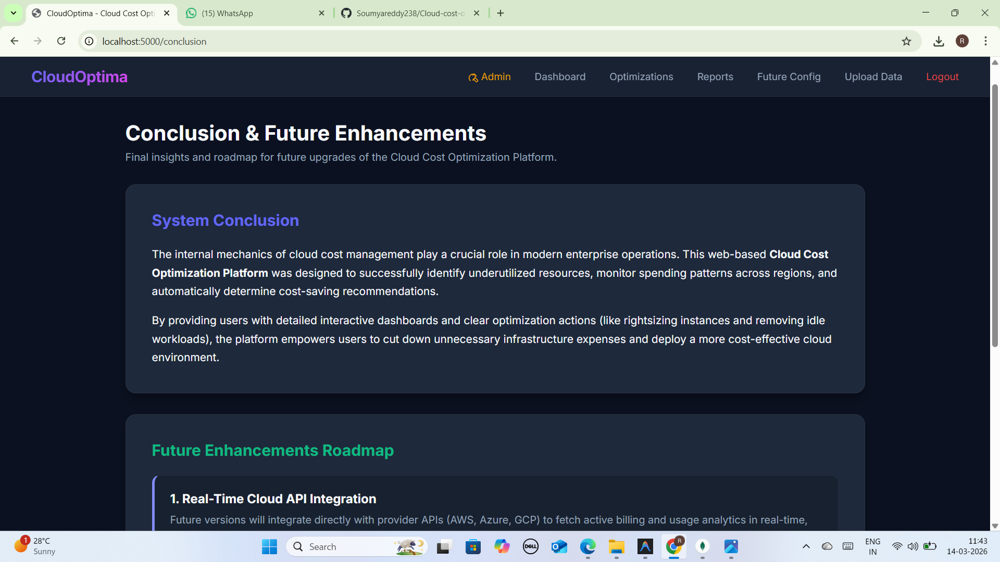

# Cloud Cost Optimization Platform

## Description
The Cloud Cost Optimization Platform is a web application developed using Python and Flask.  
It analyzes cloud usage datasets to detect high cloud bills, identify inefficient resource utilization, and provide actionable insights for cost optimization.

---

## Features
- Upload cloud usage dataset in CSV format
- Detect high cloud bills
- Analyze resource usage for inefficiencies
- Provide recommendations for optimizing cloud costs

---

## Technologies Used
- Python
- Flask
- HTML, CSS
- CSV datasets

---

## Project Screenshots

### Home Page
Landing page of the platform. Users can navigate to upload datasets and view analysis features.

### Upload Page
Allows users to upload CSV cloud usage datasets. The system prepares the data for analysis.

### Dashboard Page
Displays an overview of cloud costs, showing total usage and potential savings.

### Result Page
Detailed analysis of cloud costs, highlighting high-cost resources and inefficiencies.

### Report Page
Shows a generated report summarizing cloud cost issues and recommendations.

### Conclusion Page
Provides final observations and insights from the analysis, summarizing key findings.

## How to Run
1.Install Python 
2.Install required libraries:
pip install flask pandas
3.Run the application:
python app.py
http://127.0.0.1:5000/
## Future Improvements
Integrate a Machine Learning model to predict future cloud costs
Connect to real cloud APIs (AWS, GCP) for live analysis
Add user authentication and personalized dashboards
Visual charts for resource usage and cost optimization
Export detailed analysis as PDF reports
Add notifications for high cloud bill alerts

## Author 
Soumya Reddy 
B.Tech Computer Science Engineering 
